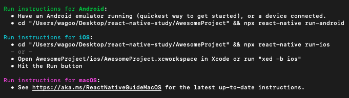

#HELLO WORLD IN REACT NATIVE

##RUN A PROJECT WITH COMMAND LINE
*To create the project*
``` bash
npx react-native init AwesomeProject
```




##DEPENDENCIES

###DEPENDENCIES SITUATION ON INIT OF THE PROJECT
``` js
"dependencies": {
    "react": "17.0.1",
    "react-native": "0.64.2"
  },
  "devDependencies": {
    // Babel is a JavaScript compiler.
    "@babel/core": "^7.12.9",
    // Contains Babel modular runtime helpers and 
    // a version of regenerator-runtime.
    "@babel/runtime": "^7.12.5",
    // ESLint is a static code analysis tool for 
    // identifying problematic patterns found 
    // in JavaScript code.
    "@react-native-community/eslint-config": "^2.0.0",
    // Babel-jest will inject the Babel plugin 
    // necessary for mock hoisting
    "babel-jest": "^26.6.3",
    "eslint": "7.14.0",
    // Jest is the library for test our app
    "jest": "^26.6.3",
    "metro-react-native-babel-preset": "^0.64.0",
    // React renderer 
    // that can be used to render React components 
    // to pure JavaScript objects, without depending 
    // on the DOM or a native mobile environment.
    "react-test-renderer": "17.0.1"
  }
```